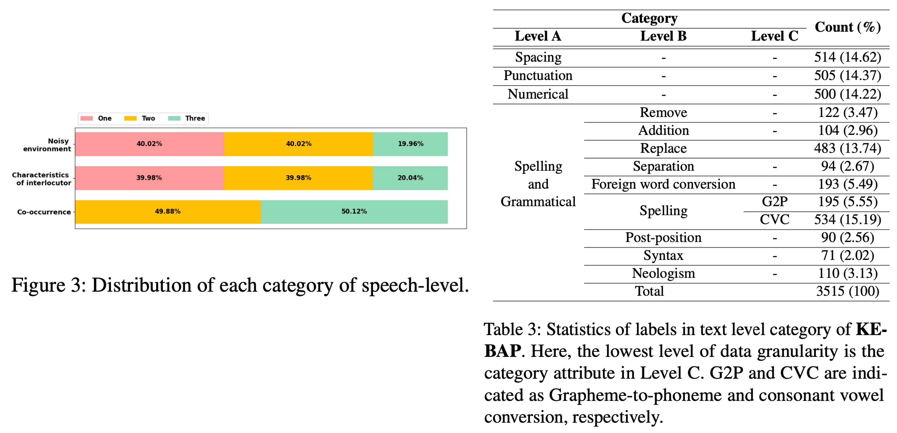
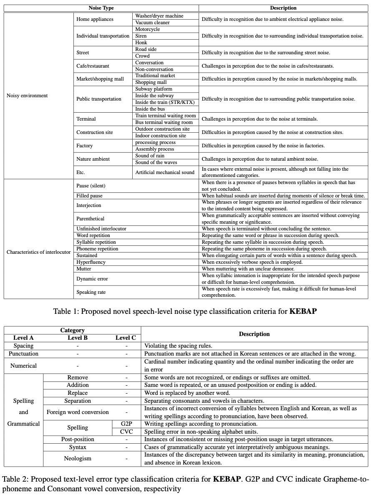

# KEBAP: Korean Error Explainable Benchmark Dataset for ASR and Post-processing

## Overview
This repository provides dataset of the following paper:

**KEBAP: Korean Error Explainable Benchmark Dataset for ASR and Post-processing**
* Seonmin Koo* , Chanjun Park*, Jinsung Kim, Jaehyung Seo, Sugyeong Eo, Hyeonseok Moon, Heuiseok Lim

---
## KEBAP
### [Dataset](./data/)

<p align="center">
     
</p>


Our *KEBAP* dataset can be found in `data/`. Please refer to *KEBAP* paper for the detail of the dataset.

### Proposed novel speech-level noise type and text-level error type
<p align="center">
     
</p>


## How to cite

```
@inproceedings{
koo2023kebap,
title={{KEBAP}: Korean Error Explainable Benchmark Dataset for {ASR} and Post-processing},
author={Seonmin Koo, Chanjun Park, Jinsung Kim, Jaehyung Seo, Sugyeong Eo, Hyeonseok Moon, and Heuiseok Lim},
booktitle={The 2023 Conference on Empirical Methods in Natural Language Processing},
year={2023},
url={https://openreview.net/forum?id=i17SCD0YDI}
}
```
